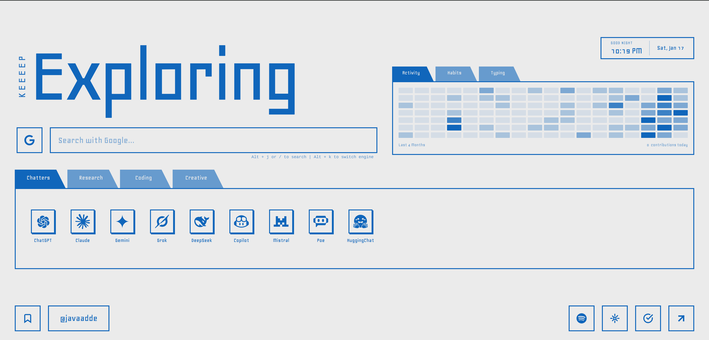
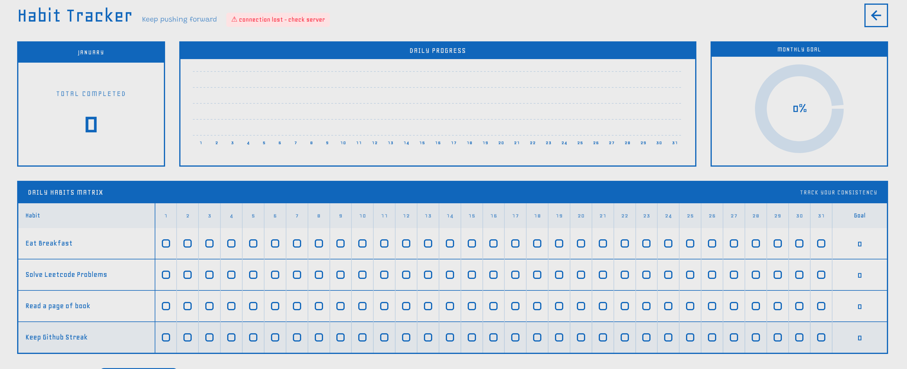
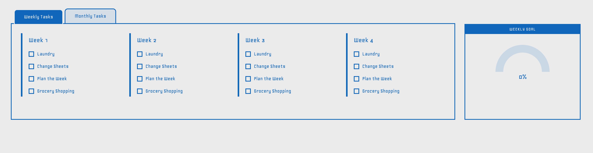
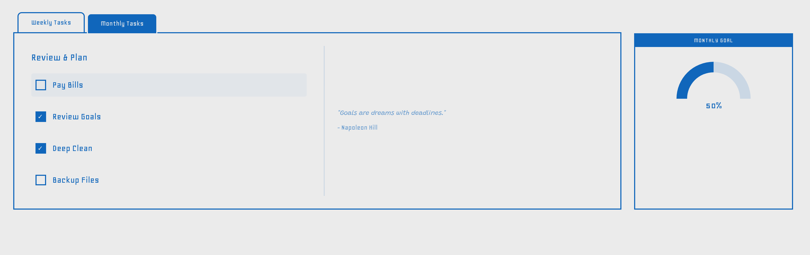
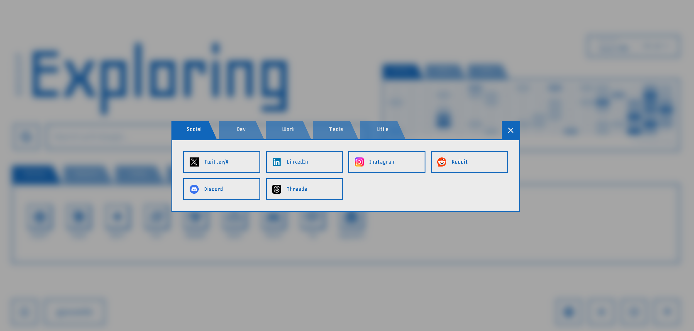
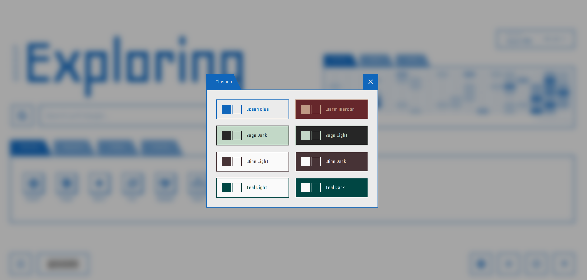

# JD New Tab - Premium Productivity Dashboard

<div align="center">


**Transform your browser's new tab into a high-performance productivity suite.**

[Installation Guide](#-installation) • [Key Features](#-features) • [Screenshots](#-screenshots) • [Tech Stack](#-tech-stack)

</div>

---

## 📸 Screenshots

<div align="center">
  <table style="width: 100%; border-collapse: collapse;">
    <tr>
      <td width="50%"><br><sub><b>Main Dashboard</b>: Minimalist AI Hub & Search</sub></td>
      <td width="50%"><br><sub><b>Habit Tracker</b>: Daily Matrix & Goal Tracking</sub></td>
    </tr>
    <tr>
      <td width="50%"><br><sub><b>Weekly Tasks</b>: Organized Planning</sub></td>
      <td width="50%"><br><sub><b>Monthly Review</b>: Goal Analysis & Quotes</sub></td>
    </tr>
    <tr>
      <td width="50%"><br><sub><b>Quick Links</b>: Categorized Resources</sub></td>
      <td width="50%"><br><sub><b>Custom Themes</b>: Vibrant Color Palettes</sub></td>
    </tr>
  </table>
</div>

---

## ✨ Features

### 🏢 **Central Command Center**
- **Dynamic Headline**: Greeting and motivational "Exploring" header.
- **Universal Search**: Integrated multi-engine search (Google, YouTube, Reddit, etc.) with shortcut support.
- **Real-time Clock**: Precise time-keeping with a modern minimal aesthetic.

### 🤖 **AI Tools Integration**
- **Instant Access**: One-click shortcuts to ChatGPT, Claude, Gemini, DeepSeek, and more.
- **Categorized Workflow**: Seamlessly switch between different AI models for research, coding, or creativity.

### 📊 **Advanced Habit Tracking**
- **Intensity Heatmap**: Large GitHub-style contribution graph to visualize your consistency across **Habits**, **Activity**, and **Typing**.
- **Typing Integration**: Track your typing progress (integrated with Monkeytype).
- **Habit Matrix**: Track multiple daily habits (e.g., LeetCode, Reading, Exercise) in a clean grid layout.
- **Progress Analytics**: Visual goal rings to monitor your monthly and yearly progress.

### 📝 **Intelligent Task Management**
- **Weekly Planning**: Segmented views for Week 1 through 4 to keep your month organized.
- **Goal Gauges**: Real-time progress indicators for your current task lists.
- **Persistence**: Tasks are saved locally and synced across your browser sessions.

### 🎨 **Personalization & UI**
- **Theme Engine**: Curated selection of themes including Ocean Blue, Sage, Wine, and Teal.
- **Glassmorphism Design**: Modern, clean, and distraction-free interface.
- **Responsive Layout**: Adapts perfectly to any screen resolution.

---

## 🛠️ Tech Stack

- **Frontend**: [React 19](https://react.dev/)
- **Styling**: [Tailwind CSS 4](https://tailwindcss.com/)
- **Build Tool**: [Vite 7](https://vitejs.dev/)
- **Icons**: [Lucide React](https://lucide.dev/)
- **Animations**: [React Flip Clock](https://www.npmjs.com/package/@leenguyen/react-flip-clock-countdown)
- **State Management**: React Hooks & Local Storage

---

## 📦 Installation

### Development Setup

1. **Clone the repository**
   ```bash
   git clone https://github.com/javaadde/jd-new-tab.git
   cd jd-new-tab
   ```

2. **Install dependencies**
   ```bash
   npm install
   ```

3. **Build the extension**
   ```bash
   npm run build
   ```

### Load in Chrome

1. Open Chrome and navigate to `chrome://extensions/`.
2. Toggle **Developer mode** in the top-right corner.
3. Click **Load unpacked**.
4. Select the `dist` folder from this project directory.
5. Open a new tab and enjoy!

---

## 📁 Project Structure

```text
jd-new-tab/
├── 📁 dist/                # Optimized production build
├── 📁 images/              # Project screenshots & assets
├── 📁 src/
│   ├── 📁 components/      # UI Components (Clock, Search, HabitGraph)
│   ├── 📁 pages/           # Main Views (Home, HabitTracker)
│   ├── 📁 utils/           # Helper functions
│   ├── 📄 App.jsx          # Root component & Routing
│   └── 📄 main.jsx         # Entry point
├── 📄 manifest.json        # Extension configuration
└── 📄 vite.config.js       # Build configuration
```

---

## 🤝 Contributing

Contributions are welcome! If you have ideas for new features or improvements, feel free to open an issue or submit a pull request.

1. Fork the Project
2. Create your Feature Branch (`git checkout -b feature/AmazingFeature`)
3. Commit your Changes (`git commit -m 'Add some AmazingFeature'`)
4. Push to the Branch (`git push origin feature/AmazingFeature`)
5. Open a Pull Request

---

## 👨‍💻 Author

**Javaad** - [@javaadde](https://github.com/javaadde)

[](https://github.com/javaadde)
[](https://javaadde.github.io/portfolio)

---

<div align="center">

### ⭐ Star this repository if you found it useful!

**Made with ❤️ for productivity enthusiasts.**

</div>